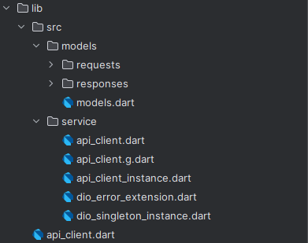
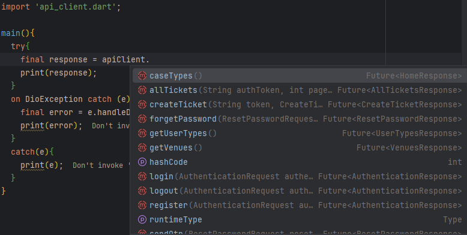

# Api Client Package

[](https://pub.dev/packages/api_client)
[](https://github.com/your_github_username/api_client/actions)
[](https://opensource.org/licenses/MIT)

## About

`api_client` is a Flutter package designed to simplify API calls using Retrofit. With this package, you can easily create request and response models, handle API calls, and manage Dio errors efficiently.

## Features

- **Easy API Integration**: Simplify your API calls using Retrofit.
- **Request and Response Models**: Organize your API requests and responses with dedicated models.
- **Dio Error Handling**: Manage Dio exceptions with a custom helper class.

## Installation

Add the following to your `pubspec.yaml` file:

```yaml
dependencies:
  api_client:
    path: packages/api_client 
```
## Screenshots

- package structure:
  
   

- how to use it:
  

